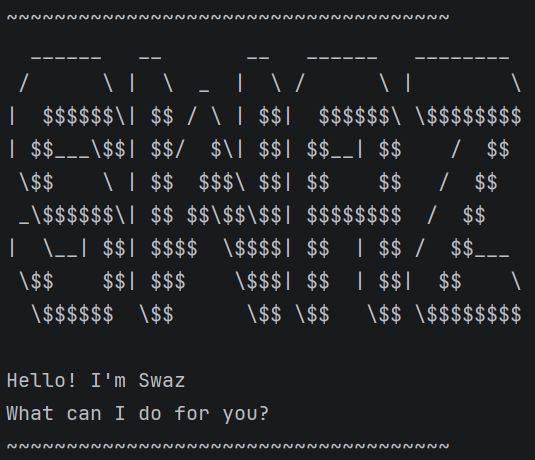

# Swaz User Guide



Swaz is a simple **Command Line Interface (CLI) task manager chatbot** that helps users manage tasks efficiently.

---

# Table of Contents

- [Quick Start](#quick-start)
- [Features](#features)
    - [Adding a ToDo](#adding-a-todo)
    - [Adding a Deadline](#adding-a-deadline)
    - [Adding an Event](#adding-an-event)
    - [Listing Tasks](#listing-tasks)
    - [Marking Tasks](#marking-tasks)
    - [Unmarking Tasks](#unmarking-tasks)
    - [Deleting Tasks](#deleting-tasks)
    - [Finding Tasks](#finding-tasks)
    - [Exiting Swaz](#exiting-swaz)
- [Command Summary](#command-summary)

---

# Quick Start

1. Run the program.
2. Type commands into the CLI.
3. Press `Enter` after each command.

All dates must follow the format: yyyy--mm--dd

Example: `2026-03-01`

---

# Features

## Adding a ToDo

Adds a task without a date.

**Format:** `todo <description>`

**Example:** `todo read book`

```
Got it. I've added this task:
[T][ ] read book
Now you have 1 task in the list.
```

## Adding a Deadline

Adds a task with a due date.

**Format:** `deadline <description> /by <yyyy-mm-dd>`

**Example:** `deadline return book /by 2026-03-01`

```
Got it. I've added this task:
[D][ ] return book (by: Mar 01 2026)
Now you have 1 task in the list.
```

## Adding an Event

Adds a task with a start and end date.

**Format:** `event <description> /from <yyyy-mm-dd> /to <yyyy-mm-dd>`

**Example:** `event project meeting /from 2026-03-01 /to 2026-03-02`

```
Got it. I've added this task:
[E][ ] project meeting (from: Mar 01 2026 to: Mar 02 2026)
Now you have 1 task in the list.
```

## Listing Tasks

Displays all tasks currently stored.

**Format:** `list`

## Marking Tasks

Marks a task as completed.

**Format:** `mark <task number>`

**Example:** `mark 1`

```
Nice! I've marked this task as done:
[T][X] Run 
```
## Unmarking Tasks

Marks a task as not completed.

**Format:** `unmark <task number>`

**Example:** `unmark 1`

```
OK, I've marked this task as not done yet:
[D][ ] buy food (by: Feb 28 2026)
```

## Deleting Tasks

Removes a task from the list.

**Format:** `delete <task number>`

**Example:** `delete 1`

```
Noted. I've removed this task:
[D][ ] buy food (by: Feb 28 2026)
Now you have 3 tasks in the list.
```

## Finding Tasks

Searches for tasks containing a keyword.

**Format:** `find <keyword>`

**Example:** `find book`

```
Here are the matching tasks in your list:
1.[T][X] read book
2.[D][ ] return book (by: Mar 01 2026)
```

## Exiting Swaz

Closes the application.

**Format:** `bye`

---

# Notes

- Task numbering starts from **1**.
- All commands are case-sensitive.
- Swaz stores tasks locally.

---

# About Swaz

Swaz is developed as part of a CS2113 project.  
It focuses on object-oriented design and incremental feature development.

